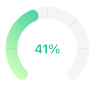
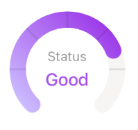

# react-native-simple-circular-progress

A simple circular progress indicator component for React Native

[![NPM version][npm-image]][npm-url]
[![Downloads][downloads-image]][npm-url]

[npm-url]: https://npmjs.org/package/react-native-simple-circular-progress
[downloads-image]: http://img.shields.io/npm/dm/react-native-simple-circular-progress.svg
[npm-image]: http://img.shields.io/npm/v/react-native-simple-circular-progress.svg

## Screenshots


## Installation

```
yarn add react-native-simple-circular-progress
```

or

```
npm i react-native-simple-circular-progress
```

## Examples

```jsx
<CircularProgress
  size={106}
  percent={75}
  gapAngle={90}
  progressBarColor={[[0, '#2C40F3'], [100, '#C2E1FF']]}
>
  <View>
    <Text>Scores</Text>
    <Text>5846</Text>
  </View>
</CircularProgress>
```


```jsx
<CircularProgress
  size={106}
  percent={41}
  progressBarColor={[[0, '#1CC490'], [100, '#CEFFBD']]}
  scaleAngles={[0, -45, -90, -135, 180]}
  scaleOpacity={0.15}
  scaleColor='#888'
>
  <View>
    <Text>41%</Text>
  </View>
</CircularProgress>
```



```jsx
<CircularProgress
  size={106}
  percent={75}
  progressBarColor={[[0, '#9C3AE9'], [100, '#CCBDFF']]}
  scaleAngles={[0, -45, -90, -135, 180]}
  scaleOpacity={0.15}
>
  <View>
    <Text>Status</Text>
    <Text>Good</Text>
  </View>
</CircularProgress>
```



## API

| prop      | type  | default value |
| --------- | ------------- | ------------- |
| `size`    | `number` |     |
| `percent` | `number` | 1 |
| `gapAngle` | `number` | 90 |
| `backgroundBarColor` | `string` | '#F5F5F4' |
| `progressBarWidth` | `number` | 15 |
| `progressBarColor` | `string` `[number, string][]` | '#2C40F3' |
| `progressBarOpacity` | `number` | 1 |
| `progressFillColor` | `string` | 'none' |
| `scaleAngles` | `number[]` |  |
| `scaleWidth` | `number` | 2 |
| `scaleColor` | `string` | '#2a2a2a' |
| `scaleOpacity` | `number` | 0.1 |
| `svgExtraProps` | `Record<string, any>` | {} |
